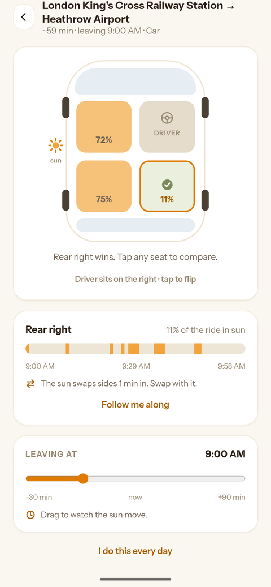

<div align="center">


# Sunny Side Down

**Find the seat the sun can't reach.**

[Try it](https://sohamdixit.github.io/sunny-side-down/) · [Privacy](https://sohamdixit.github.io/sunny-side-down/privacy-policy.html)

</div>

---

The sun only shines on one side of the car. Sit on the wrong side and you spend
the whole journey squinting, sweating, and slowly cooking through the window.

Sunny Side Down works out which side that is, before you get in.

<div align="center">

</div>

## Why it needs your route

Roads bend, and the sun keeps moving. A seat that's cool when you set off can be
roasting by the time you arrive, so glancing at the sky tells you almost nothing.

The app checks where the sun will be along *every stretch* of your journey and
adds it up, so the answer covers the whole trip. It'll also tell you when the sun
swaps sides mid-route, so you can swap with it.

It works anywhere: it figures out which side the driver sits on, so it never
suggests you take their seat. At night it just tells you to sit wherever you
like, because the sun is asleep.

No account, no ads, no server. Saved journeys stay on your phone.

## How it's built

A React app wrapped with Capacitor — one codebase, shipping as a real Android
app.

**The interesting part is `src/lib/exposure.ts`.** It slices your route into 60
segments and, for each one, compares the direction you're travelling against
where the sun actually is at that moment. Sun off your right shoulder means the
left seats are shaded. Add it up across the whole route, weight it by how much
each sun angle actually matters, and you get a percentage per seat.

That weighting is the bit worth knowing about. Low sun comes in horizontally
through a side window and lands right on you; overhead sun is a roof problem no
seat choice can fix. So exposure scales with `cos(elevation)` — which holds up
whether you're in Bengaluru or Reykjavík.

Everything else is supporting cast:

| | |
|---|---|
| `lib/sun.ts` | Solar position, on-device, no API |
| `lib/geo.ts` | Route geometry — bearings, distances, progress along a polyline |
| `lib/api.ts` | Routing (Mapbox) and place search (Photon) |
| `lib/location.ts` | Geolocation that works the same on web and device |
| `screens/` | Three of them: search, result, saved journeys |

## Running it

```bash
npm install
npm run dev
```

Routing needs a Mapbox token — copy `.env.example` to `.env` and drop one in.
Without it the app falls back to a keyless OSRM server that's fine for
development but not for real use.

For the Android build:

```bash
npm run build && npx cap sync android
cd android && ./gradlew assembleDebug
```

Some useful extras: `?dep=HH:MM` pretends you're leaving at a different time, so
you can check daytime verdicts at night. `npx tsx scripts/suntest.ts` sanity-checks
the solar geometry against known routes. `docs/CONTRIBUTING.md` has the details
that only matter once you're actually changing things.

## Status

In closed testing on Google Play. It works, but it's young — if a verdict looks
backwards or a place can't be found, that's worth telling me about.
